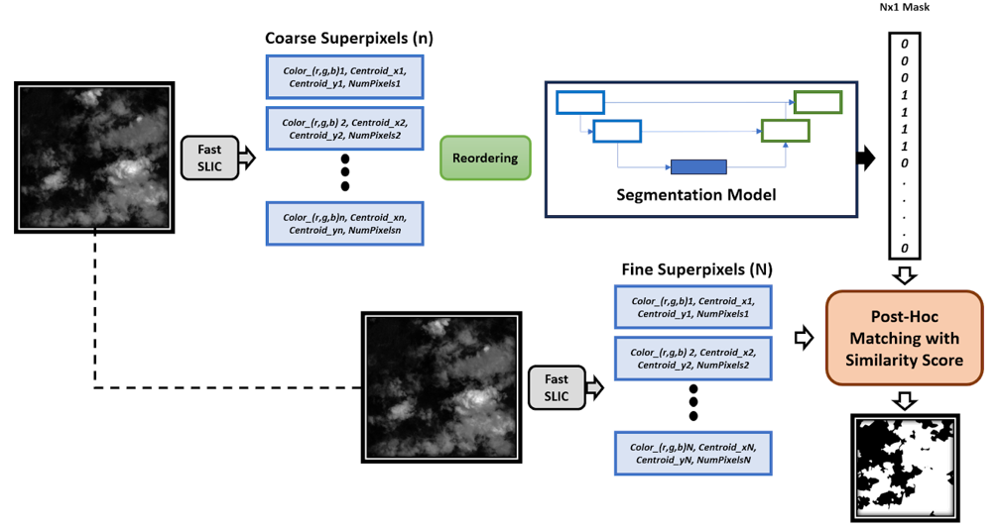
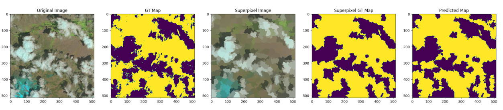

# Computer Vision and Deep Learning (Project)
### Superpixel Clustering and Post-Hoc correction to improve the performance of cloud segmentation from satellite images

#### Abstract:
We implement a 1D-SEUNet model on Superpixel vectors of satelite images to segment out the cloud from the background. Our method aims to reduce the parameters and increase the speed of a conventional segmentation model.

#### Main Libraries used
- Pytorch
- Fast-SLIC
- Rasterio
- Sklearn (MDS and PCA)

#### Model
</img>

#### Results
</img>
